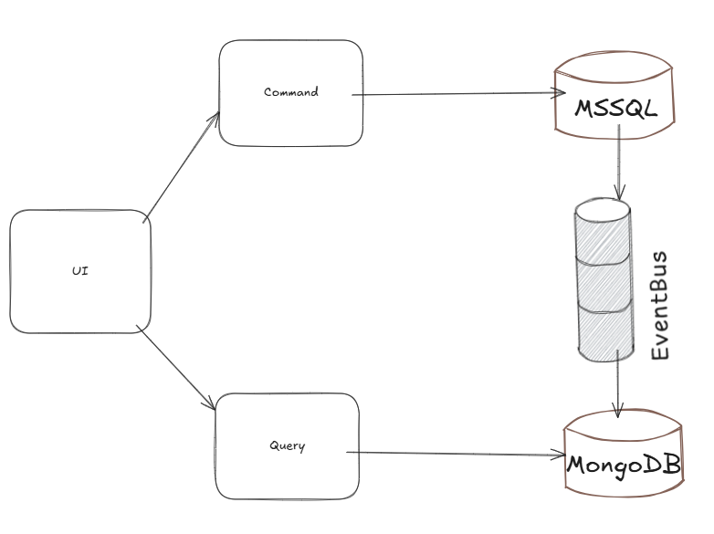

# CQRS Demo - Bank System

This project demonstrates the implementation of the **CQRS (Command Query Responsibility Segregation)** pattern using .NET Core. The example domain is a **Bank Account** system, where commands modify data and queries fetch data. The solution is separated into two services:

- **Command Service** (Write side)
    - **APIs**: `CreateAccount`, `CloseAccount`, `Deposit`, `Withdraw`
    - The command service handles operations that modify the state of the bank account and sends events to the message queue to handle Eventual consistency using RabbitMQ.

- **Read Service** (Query side)
    - **APIs**: `GetAccountById/{id}`, `GetAccounts?pageSize=&pageIndex=`
    - The read service listens to events from RabbitMQ, updates the MongoDB database, and exposes query endpoints for reading data.

## Technologies Used

- **.NET Core** 8
- **MassTransit** (for RabbitMQ message publishing and consumption)
- **MSSQL** (for the Write model)
- **MongoDB** (for the Read model)
- **RabbitMQ** (for event-driven communication between services)

## Solution Overview

1. **Write Service (Command Side)**:
    - The command service receives HTTP requests (via APIs) that change the state of bank accounts.
    - After processing the commands, the service publishes events to a RabbitMQ queue.

2. **Read Service (Query Side)**:
    - The read service exposes APIs to query bank account information.
    - The read service listens to events published by the command service.
    - It processes events and updates a denormalized MongoDB read model.

---

## Architecture



### Write Side (Command Service)
- **MSSQL Database**: Stores the state of the bank account (account holder, balance, etc.).
- **MassTransit + RabbitMQ**: Used to publish events (e.g., `BankAccountCreated`, `Deposited`, `Withdrew`, `BankAccountClosed`) to RabbitMQ after command processing.

### Read Side (Query Service)
- **MongoDB**: Stores the read model, which is a simplified, denormalized version of the bank account data optimized for querying.
- **MassTransit**: Listens to the events from RabbitMQ and updates the MongoDB read model accordingly.

### Event-Driven Approach
The Read Service listens to events published by the Command Service, ensuring that the data is eventually consistent between the write and read models.

---

## Command Service (Write Side) API Endpoints

### 1. Create Bank Account
- **Endpoint**: `POST /api/BankAccount/CreateAccount`
- **Description**: Creates a new bank account.
- **Request Body**:
    ```json
    {
      "name": "Bùi Quốc Hào",
      "initialBalance": 1000,
      "currency": "VND"
    }
    ```
- **Response**:
    - Status 200 OK: Account created successfully

### 2. Close Bank Account
- **Endpoint**: `POST /api/BankAccount/CloseAccount`
- **Description**: Closes an existing bank account.
- **Request Body**:
    ```json
    {
      "accountId": "7c0aa63d-ff2e-4301-9ab2-18f154f0a3e7",
      "reason": "string"
    }
    ```
- **Response**:
    - Status 200 OK: Account closed successfully

### 3. Deposit Funds
- **Endpoint**: `POST /api/BankAccount/Deposit`
- **Description**: Deposits funds into an existing bank account.
- **Request Body**:
    ```json
    {
      "accountId": "e64dfea3-79fc-4521-9af1-67f99427b721",
      "amount": 8000
    }
    ```
- **Response**:
    - Status 200 OK: Deposit successful

### 4. Withdraw Funds
- **Endpoint**: `POST /api/BankAccount/Withdraw`
- **Description**: Withdraws funds from an existing bank account to another bank account.
- **Request Body**:
    ```json
    {
      "accountId": "7c0aa63d-ff2e-4301-9ab2-18f154f0a3e7",
      "destinationId": "913f73dd-2903-4e7d-a845-2a95d9027daf",
      "amount": 100000
    }
    ```
- **Response**:
    - Status 200 OK: Withdrawal successful

---

## Read Service (Query Side) API Endpoints

### 1. Get Bank Account by ID
- **Endpoint**: `GET /api/Account/GetAccountById/{accountId}`
- **Description**: Retrieves a bank account by its ID.
- **Response**:
    ```json
    {
      "accountId": "12345",
      "accountHolder": "John Doe",
      "balance": 1300,
      "currency": "USD",
      "isActive": true
    }
    ```

### 2. Get All Bank Accounts
- **Endpoint**: `GET /api/Account/GetAccounts?pageSize=20&pageIndex=1`
- **Description**: Retrieves bank accounts with pagination.
- **Response**:
    ```json
    {
      "accounts": [
        {
          "id": "7366369a-67ff-4aef-975d-9cc44eafce99",
          "accountHolder": "1",
          "balance": 100000,
          "currency": "VND",
          "isActive": true
        }
      ],
      "total": 1
    }
    ```

---

## Setup and Running the Application

### Prerequisites

- .NET Core 8 SDK
- RabbitMQ running locally or on a remote server
- MSSQL Server (for the Write model)
- MongoDB (for the Read model)

### Steps to Run Locally

1. Clone the repository:
    ```bash
    git clone <repository_url>
    cd <repository_directory>
    ```

2. Build the solution:
    ```bash
    dotnet build
    ```

3. Start the required services:
    - **RabbitMQ**: Make sure RabbitMQ is running locally or configure it in `appsettings.json`.
    - **MSSQL Server**: Set up the MSSQL database (e.g., `BankAccountDB`) or using in-memory database.
    - **MongoDB**: Set up the MongoDB instance for the read model is running locally or remote server.

4. Run the Command Service and Read Service:
    - Open two terminal windows and run each service:
      ```bash
      dotnet run --project CQRS.Write/CQRS.Write.csproj
      dotnet run --project CQRS.Read/CQRS.Read.csproj
      ```

5. Test the APIs using Swagger or Postman.

---

## Conclusion

This demo showcases the application of the **CQRS pattern** using a **Bank Account** system. The write side modifies the bank account data and sends events to RabbitMQ, while the read side consumes those events and updates a MongoDB read model. This pattern allows for better scalability, performance, and separation of concerns between the command and query sides of the application.

---

## Future Improvements

- **Event Versioning**: Consider versioning events to handle changes in the domain model over time.
- **Error Handling**: Implement more robust error handling for event consumption and database updates.
- **Event Sourcing**: Add event sourcing for a more comprehensive CQRS implementation.
- **Authentication and Authorization**: Secure the APIs with authentication and authorization mechanisms.

---

## License

This project is licensed under the MIT License - see the [LICENSE](LICENSE) file for details.
